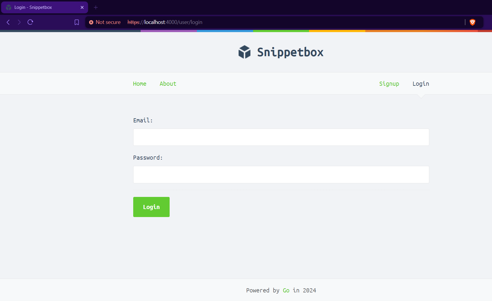

# Snippetbox

A simple website built with [Go programming language](https://go.dev/) and its template engine. This project is taken out from [Let's Go](https://lets-go.alexedwards.net/) by [Alex Edwards](https://www.alexedwards.net/).

## Features:

1. View Snippet
2. Create Snippet
3. Register Account
4. Login
5. Reset Password
6. TLS Support

## Project Structure

The project is structured as follows:

1. `cmd/web` -> contains the core application related logic. All routes, middlewares, helper functions, handlers and template parsing functionality resides here

2. `internal/` -> this module contains all the necessary functions to support validation logic, test setup and data models for the applications.

3. `ui/` -> contains static assets, templates to be rendered on the website.

# Screenshots

<h3>Home Page</h3>

<h3>Sign Up Page</h3>

<h3>Login Page</h3>

<h3>Snippet Create Page</h3>

<h3>Account Detail Page</h3>

<h3>Password Reset Page</h3>

